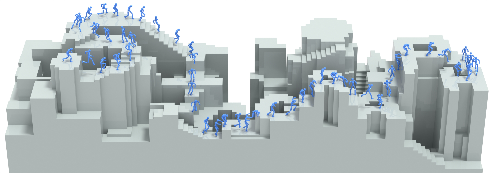

# PARC

Project page: https://michaelx.io/parc

# Installation
Tested with Ubuntu 22.04

**Optional**: Install Isaac Gym (https://developer.nvidia.com/isaac-gym) for motion tracking

Install requirements:
```
conda create -n parc python=3.8.20
conda activate parc
pip install -r requirements.txt
```
and it should be good to go. If pytorch is not being able to detect CUDA, try reinstalling:
```
pip install torch==2.2.0+cu118 -f https://download.pytorch.org/whl/torch_stable.html
```
You can then run scripts such as:
```
python scripts/run_motionscope.py
```

## Motionscope
Motionscope is my motion/terrain editor, as well as motion generator visualizer, built on top of Polyscope: https://polyscope.run/py/. You can run it by running:
```
python scripts/run_motionscope.py
```

Before that, you must edit the config file `parc/motionscope/motionscope_config.yaml` to load the motion you want, as well as optionally load an MDM model.

## Dataset and Models
Download the datasets from the initial iteration and each stage of PARC.


### New release: https://huggingface.co/datasets/mxucg/PARC
Two separate PARC experiments (Dec 2024 with 4 iterations, April 2025 with 5 iterations).
New small model (~30 mb).


These files are loaded with anim/motion_lib.py and anim/kin_char_model.py.
You can view them with scripts/run_motionscope.py, by editing the "motion_filepath" param in parc/motionscope/motionscope_config.yaml

If you only want the data without installing the whole repo, check out the script: scripts/read_motion_data.py
You should only need numpy (and maybe pytorch?) to read the data.


(Old release:
https://1sfu-my.sharepoint.com/:f:/g/personal/mxa23_sfu_ca/Et16uLMFxoRKouibvBa7LbwBEmX5_iI5a8dZyiMc0wmSTA?e=ihma1b
The password is "PARC". The file format is only compatible with v0.1 PARC release.)

## User configuration
All configuration files reference data, checkpoints, and generated outputs through a `$DATA_DIR` placeholder. Set this base
directory in `user_config.yaml` at the repository root:

```
DATA_DIR: "/absolute/path/to/your/data"
```

`DATA_DIR` must be an existing absolute path. The training and pipeline scripts will automatically replace `$DATA_DIR` in YAML
configs with the configured value when they load them.


## Motion Tracking
PARC's motion tracking module was written using Isaac Gym, based on an early version of MimicKit. Isaac Gym is deprecated and there are now many great open-source motion tracking repositories. I personally recommend using https://github.com/xbpeng/MimicKit

The recipe for building a blocky terrain style motion tracking environment as shown in PARC is to start from a DeepMimic environment, but to load in a terrain that is composed of all the terrain-motion pairs in your dataset laid out as a grid. The environment should keep track of which motion-terrain each agent is currently learning, book-keeping the position offset for the agent and reference motions.

If you still wish to use Isaac Gym, then install it here: https://developer.nvidia.com/isaac-gym

I recommend using their installation scrip to install it within a **conda** environment with python 3.8.20 (Other versions may also work, but not tested).

The isaac gym helper yaml should look like this:
```
name: parc
channels:
  - pytorch
  - conda-forge
  - defaults
dependencies:
  - python=3.8.20
  - pytorch=2.20.0
  - torchvision=0.9.1
  - cudatoolkit=11.1
  - pyyaml>=5.3.1
  - scipy>=1.5.0
  - tensorboard>=2.2.1
```

## Codebase Guide
* [PARC Guide](doc/parc_guide.md)

## Citation
If you find PARC helpful, please consider citing the references in the [citation document](./doc/cite.md).