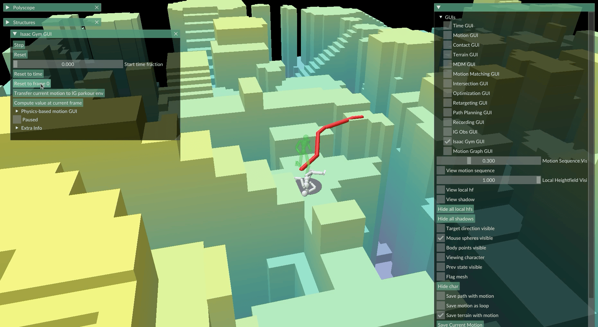

# PARC

Project pages: https://michaelx.io/PARC

# Getting Started
Tested with Ubuntu 22.04
Install IsaacGym: https://developer.nvidia.com/isaac-gym
Install requirements:
pip install -r requirements.txt
and it should be good to go. If pytorch is not being able to detect CUDA, try reinstalling:
pip install torch==1.13.1+cu117 -f https://download.pytorch.org/whl/torch_stable.html

## Codebase Guide
The PARC training loop consists of 4 main stages, which are individually run by:
```
python parc_1_train_gen.py --config path/to/config
python parc_2_kin_gen.py --config path/to/config
python parc_3_tracker.py --config path/to/config
python parc_4_phys_record.py --config path/to/config
```

These modules are independent and flexibly configured using configuration files. However, to aid in setting up all the configuration files for a PARC iteration, we provide the following script:
```
parc_0_setup_iter.py
```

To create a dataset file, we provide the script:
```
parc_5_create_dataset.py
```
This file also computes sampling weights, which is useful when there is much more motion data for certain types of clips than others (e.g. lots of running motions, few climbing motions).

## Train Generator
Run parc_1_train_gen.py

## Generate Motions
Run parc_2_kin_gen.py

## Train Tracker
Run parc_3_tracker.py

## Record Motions
Run parc_4_phys_record.py

After recording motions, they need to be organized and hf_extra_vals must be computed:
run zmotion_editing_tools/organize_recorded_dm_motions.py, then zmotion_editing_tools/process_motions.py:compute_hf_extra_vals.

## MOTION_FORGE
The mouse cursor controls target direction and editing of terrain.

Hotkeys:
A: Change terrain height
N: Place waypoint
G: Generate motion

Quick way to test motion generator and tracker:
1. Load terrain with motion_forge.py (config file is in MOTION_FORGE/motion_forge_config.yaml).
2. Place two waypoints using N
3. Create path using GUIs -> Path Planning GUI -> A*
4. Generate motion frames using GUIs -> Path Planning GUI -> Generate Frames from start until end of path (May need to adjust max motion length in "MDM gen along path config", default is 10 seconds)
5. Select and view generated motions in GUIs -> Motion GUI -> Loaded Motions
6. Test tracker with GUIs -> Isaac Gym GUI -> Start Isaac Gym, then "Transfer Current Motion to Isaac Gym GUI" (This requires you to hard code the terrain and model paths in MOTION_FORGE/include/isaac_gym_gui.py)

You can also load the default terrain with it's default motion, and go to step 6 right away.

You can also generate motions based on the current motion frame and target direction using the "G" key.

Edit the terrain using the "A" key, and check out what you can do with the Terrain GUI.

## Dataset and Models
Download the datasets from the initial iteration and each stage of PARC, as well as the models trained in the 3rd PARC iteration.
https://1sfu-my.sharepoint.com/:f:/g/personal/mxa23_sfu_ca/Et16uLMFxoRKouibvBa7LbwBEmX5_iI5a8dZyiMc0wmSTA?e=ihma1b

## TODO
- train and release more iterations of PARC generator and tracker
- better isaac gym terrain integration, so edited terrain can be simulated immediately instead of reloading from config files
- MOTION FORGE will get a complete overhaul to be more user-friendly

## Example of Issac Gym Integration in Motion Forge
