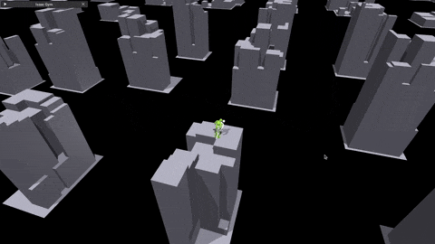

# PARC Guide

PARC is a self-consuming self-correcting generative model framework which trains both a kinematic motion generation model and a physics-based tracking controller, while also generating spatial, temporal, and functional variations of motions in the initial dataset. In the first demonstration of PARC (SIGGRAPH 25'), the motions of interest are terrain-traversal motions. However, this guide will be written in a way so that you can try to apply PARC to different tasks.

## PARC Loop
The PARC training loop consists of 4 main stages, which are individually run by:
```
python scripts/parc_1_train_gen.py --config path/to/config
python scripts/parc_2_kin_gen.py --config path/to/config
python scripts/parc_3_tracker.py --config path/to/config
python scripts/parc_4_phys_record.py --config path/to/config
```

These modules are independent and flexibly configured using configuration files. However, to aid in setting up all the configuration files for a PARC iteration, we provide the following script:
```
scripts/parc_0_setup_iter.py
```
This file also computes sampling weights, which is useful when there is much more motion data for certain types of clips than others (e.g. lots of running motions, few climbing motions). It also pre-computes some terrain data that will help with augmentation when training the motion diffusion model.

## Motion Diffusion Model
The first step of PARC is to train a motion generator on the initial dataset.

### Important Files

`parc/motion_generator/mdm.py` contains the motion diffusion model class with local heightmap and local target direction conditions.

`parc/motion_generator/mdm_transformer.py` is where the transformer module is implemented

`parc/motion_generator/mdm_heightfield_contact_motion_sampler.py` is the weighted-with-replacement dataset sampler


## Procedural Motion Generation
PARC (SIGGRAPH 25') has a pretty complex system for generating new motions. The generated motions are corrected using various heuristics that were designed to make the motions easier to track with a tracking controller in simulation.

### Important Files
`scripts/parc_2_kin_gen.py` This is the main procedural generation script. Given an mdm model and a config, this script generates terrain -> path -> generation n candidate motion sequences -> kinematic selection heuristic to get top k sequences -> hesitation frame removal -> kinematic optimization -> save motion and mirrored motion. The terrain and path generation modules are designed for our terrain traversal task. These can be swapped out or expanded upon if you want to try applying PARC to different tasks (object interaction, multi-character interaction, etc.). The procedural generation for these different tasks will of course require some human knowledge and heuristics to design.

`parc/motion_synthesis/procgen/astar.py` for generating paths on terrain by treating the terrain as a graph and using a custom A* algorithm to plan.

`parc/motion_synthesis/procgen/mdm_path.py` for generating motions autoregressively along a path and terrain

`parc/util/terrain_util.py` various terrain utilities, including the SubTerrain class and terrain generation algorithms (random boxes, random stairs, random paths).

## Motion Tracking Controller
`scripts/parc_3_tracker.py` is the script for launching motion tracking controller training.

`parc/motion_tracker/run_tracker.py`

Our tracking environment is split into two environments:

`parc/motion_tracker/envs/ig_parkour/ig_parkour_env.py`

`parc/motion_tracker/envs/ig_parkour/dm_env.py`

`ig_parkour_env` is the main environment which can train agents in sub-environments like `dm_env`. Currently `dm_env` is the only sub-environment.

Below is an example of ~16000 generated terrains with their own associated reference motions, laid out in a grid in our motion tracking environment. The simulator starts having accuracy issues when characters are too far from the origin (we suspect this is due to numerical issues with large numbers), so this grid arrangement works much better than a line arrangement.



## Recording Motions
`scripts/parc_4_phys_record.py`

This script loads a tracking controller and dataset of reference motions, and records the physically simulated motions from the tracking controller for all the motions in parallel. Only the motions where the tracking controller doesn't trigger early termination are saved, so we don't add failed motions back to the dataset. In the PARC loop, this script loads the final checkpoint of the tracking controller from `parc_3_tracker` and the dataset of generated reference motions from `parc_2_kin_gen`.

Sometimes a reference motion has a particular segment that is too difficult to track, but the rest of the motion is interesting and is able to be tracked. This script helps address this case by attempting to record at different starting times. If the whole motion can be tracked, then we have a good recorded motion and it is saved. If it can't be tracked, then we initialize the simulated character and reference motion at a later time and try again. If it can't be tracked even after initializing at the 50% mark, then we give up.